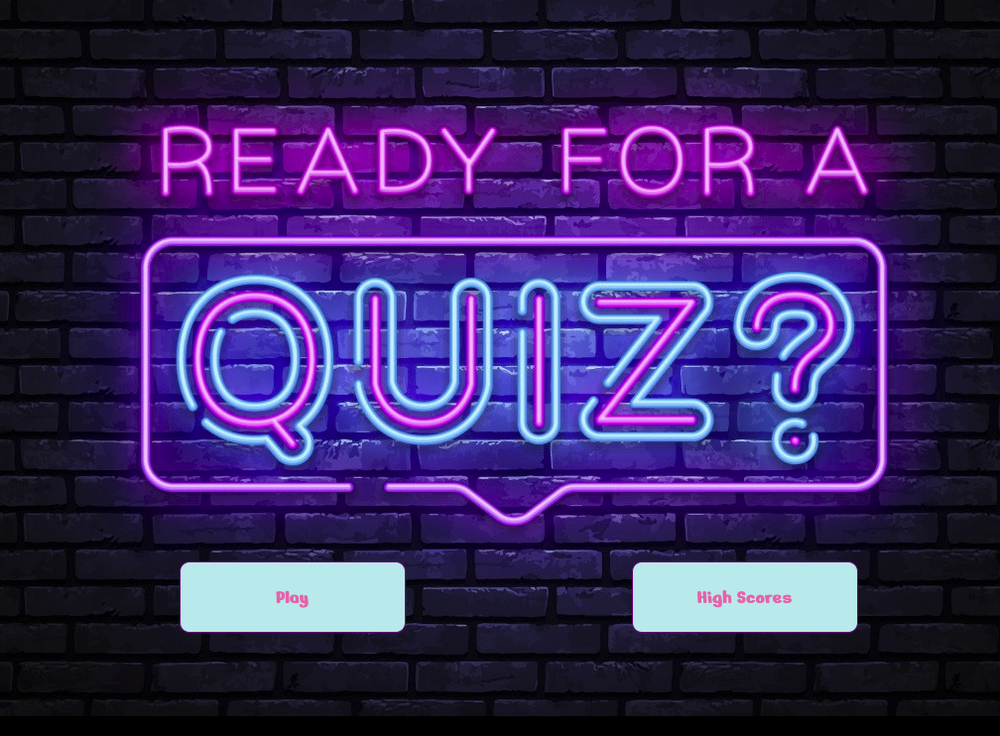
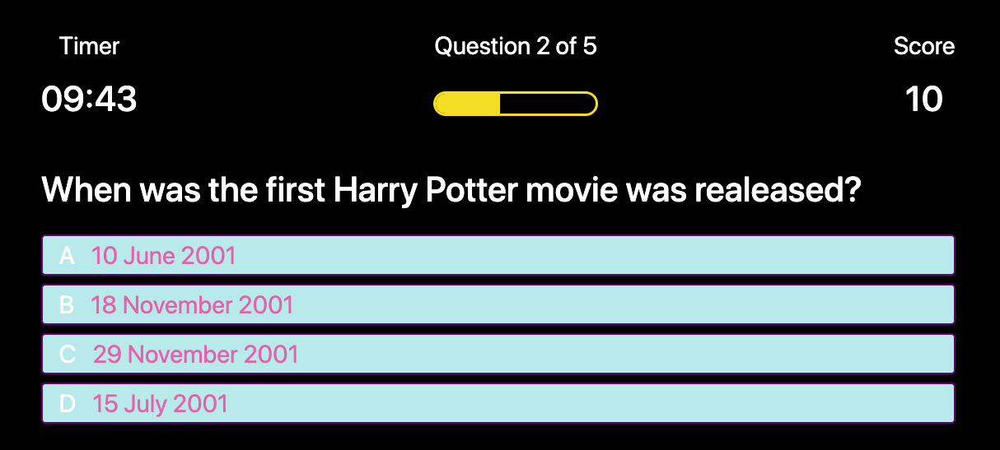
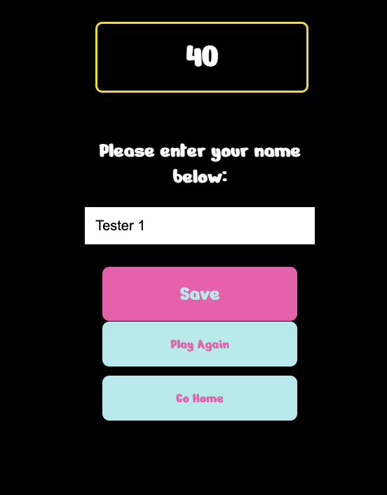
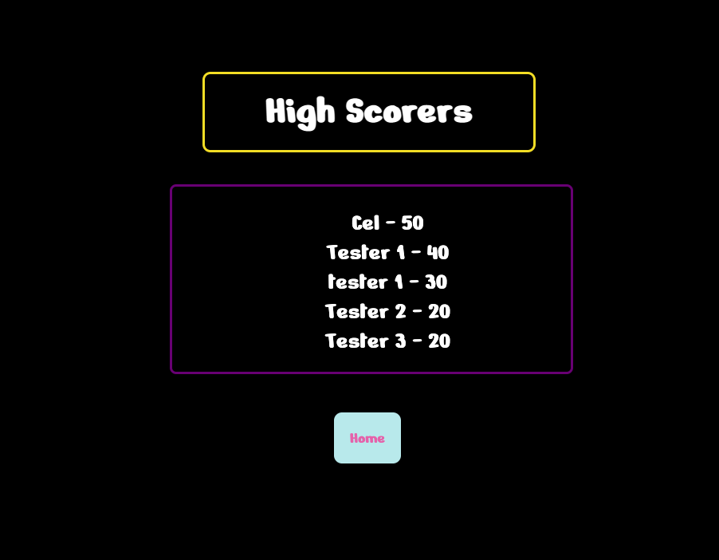

# Quiz Game
This game consist of 5 multiple choice questions and must be answered within the time limit. I set the limit to 10 minutes for all the questions, the user will also get 10 points per correct answer. Every wrong answer, 3 minutes will be deducted on the remaining time.

Once the timer reach 0 or the user finishes all the questions, a new page will turn-up with your final score. This page will allow you to save your name with your final score also, it can redirect you back to the Homepage or to start another quiz.

Home page will give you an option to play another round or check the high scorers of the game

## Installation

To be able to make this page fully functional, I created 4 .HTML file that is linked with 3 .CSS file and 3 .JS file.
First, I created index.html and I linked it with style.css. This is mainly for the Home Page where the user can start the quiz or can check the High Scorers of the game.  

Then, I created the game2.html that is linked with quiz_tyle.css and script.js. This files focuses on the structure of the quiz and the functionality of the timer, progress and the score.

I also created an end_game.html that is linked with end_game.js and still using style.css. This page will show once the timer is finihed or the 5 questions are done. It will show the final score of the player and whill have an option to save their scores, play again or go back to Home Page.

Lastly, highscores.html is created to show the list of high scores once a player click on the High Score buttons. This file is liked with the highscores.css and highscores.js

## Usage

[Timed Quiz with Scores Page](https://criscel.github.io/Quiz-Game/)

## Credits

[Code Validator](https://validator.w3.org/nu/)
[MDN Javascript](https://developer.mozilla.org/en-US/docs/Web/JavaScript)
[W3Scools](https://www.w3schools.com/js/default.asp)

### Difficulties

I had a lot of difficulties in finishing this page. it took me a lot of researches to make the JSON and local storage work at the same time I learned how to toggle results and a lot more techniques.

I also tried to incorporate some JQuery but encountered some errors so I decided to leave it with the basic javascript at the moment and re-watch the lectures.

### Jekyll Themes

This Page uses the layout and styles from the Jekyll that I have selected [Thanks Github! :)]

